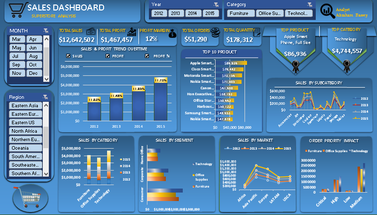

# Global-Sales-Performance-Profitability-Dashboard (Excel)
This project is an interactive Excel dashboard that analyzes global retail sales data to uncover insights on sales performance, profitability, and customer behavior. It highlights key metrics such as revenue, profit, and profit margin, while exploring the impact of discounts, product categories, and regional performance using dynamic visualizations and filters. “This project is part of my data analytics portfolio, showcasing my ability to transform raw data into actionable insights using Excel" [Download file to view project].

## 📊 Dashboard Preview

## Key Features
<li>KPI tracking (Sales, Profit, Profit Margin, Orders)</li>
<li>Sales & profit trend analysis over time</li>
<li>Top 10 products and customer insights</li>
<li>Discount vs Profit impact analysis</li>
<li>Regional and market performance breakdown</li>
<li>Interactive slicers for dynamic filtering</li>

## Key Insights
<li>Total Sales: $12.64M and Total Profit: $1.47M indicate a ~12% profit margin, which is healthy but leaves room for optimization.</li>
<li>The business is clearly profitable, but margins suggest cost or discount inefficiencies may exist.</li>
<li>Sales and profit show a consistent upward trend year-over-year.
2015 is the peak year, contributing the highest revenue and profit.
This suggests successful scaling strategies or increased market demand over time.</li>
<li>Technology (~$4.74M in sales)
→ Clearly the primary revenue driver.</li>
<li>Consumer segment dominates sales, outperforming Corporate and Home Office.
Suggests:
Strong B2C positioning
Potential to grow B2B (Corporate) revenue</li>
<li>High and Medium priority orders generate the most revenue.
Critical/Low priority orders contribute significantly less.
→ Indicates that urgent demand drives more sales volume.</li>

## Key business takeaways 
I would recommend for the business to;
<li>Focus on Technology category expansion (biggest revenue driver)</li>
<li>Improve low-performing markets (Africa, LATAM)</li>
<li>Increase Corporate segment engagement</li>
<li>Optimize profit margins (12% could be improved)</li>
<li>Leverage high-priority orders as a growth lever</li>

## Tools and Technique Used
<li>Microsoft Excel</li>
<li>Pivot Tables</li>
<li>Pivot Charts</li>
<li>Slicers (for interactivity)</li>
<li>Data Cleaning & Transformation</li>
<li>Calculated Fields (Profit Margin, KPIs)</li>
<li>Conditional Formatting</li>
<li>Dashboard Design & Data Visualization</li>

